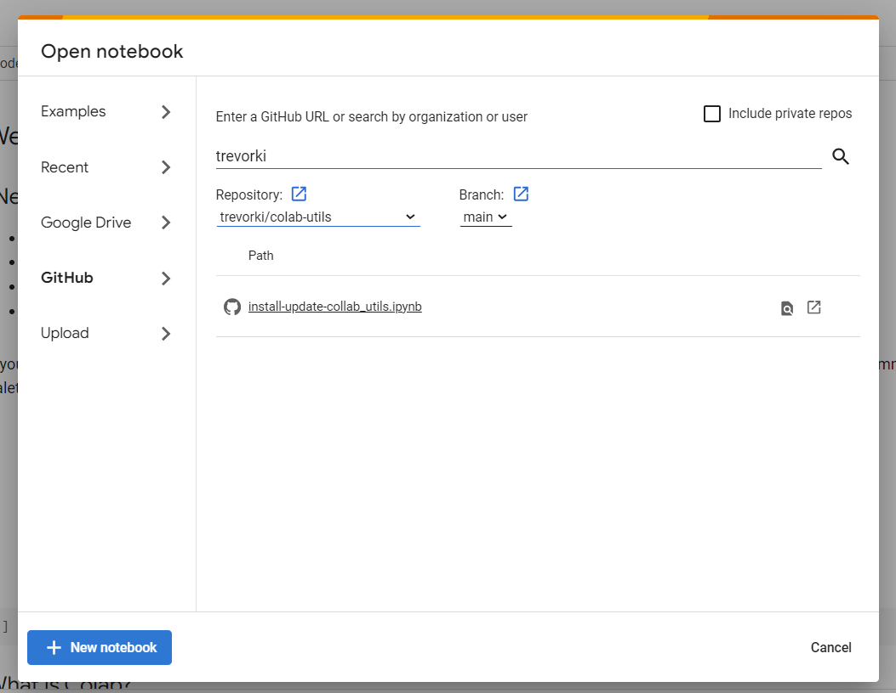

# colab-utils

 [Google Colab](https://colab.research.google.com/)  is a nessecary evil sometimes when you need to train large models. But the interface is the absolute worst... little control over where notebooks are stored, difficulty with version control, and no access to local functions or modules. It practically encourages you to create massive and disorganized notebooks and never reuse code.

This module provides few simple functions that simplify a Google Colab / Google Drive / Github workflow. *It's not like it makes it EASY... but it makes it a bit less sucky*. The basic idea is:

- Create a repo and work on it until you need a colab notebook for training
- Open a notebook from repo in Google Colab from github
- Clone the repo into google drive
- Do whatever training, etc the you need to do in the notebook
- Save model to the repo folder in Google Drive or push to Huggingface Hub
- Save notebook back to github using the `Save a copy in Github` 

Subsequent work can be continued using the same notebook by opening it either from Github or Google Drive.

## Pre-Installation

- Create a `repos` folder in your google drive. This will be mounted as `/content/gdrive/MyDrive/repos`
- Create a [Github token](https://docs.github.com/en/authentication/keeping-your-account-and-data-secure/managing-your-personal-access-tokens) with repo access
- Create a file `repos/env.json` that contains all your secrets, that looks like this:

```json
{
    "GH_TOKEN":"<github_token>",
    "GH_USERNAME":"<github_username>",
    "GH_NAME":"<firtname lastname>",
    "GH_EMAIL":"<github_email>",
    "HF_TOKEN": "<huggingface token>"
}
```

## Installation

1. Go to [Google Colab](https://colab.research.google.com/) and in the **Open notebook** window, select **GitHub** on the left, then locate this repo and open `install-update-colab_utils.ipynb`

2. Step through the *clone repo* steps suntil you see the repo is cloned into a folder on your google drive.

## Usage

```python
import colab_utils
import os
```

Load github auth info, secrets, etc from `env.json` in your google drive to environment variables:

```python
colab_utils.load_env_vars("/content/gdrive/MyDrive/repos/env.json")
```

Clone a repo:

```python
# navigate to folder where you keep repos
os.chdir("/content/gdrive/MyDrive/repos")

# clone repo
colab_utils.git_clone_repo("user_name/repo_name")

# navigate into repo folder
os.chdir("repo_name")
```

## Starting a new notebook

Once the repo is cloned, you can import the colub_utils module and start using it in new notebooks by with the following code.

```python
# Connect to google drive
from google.colab import drive
os.chdir("/content")
drive.mount("/content/gdrive")

# Load colab_utils funtions
import os
import sys
sys.path.append(f"/content/gdrive/MyDrive/repos/colab-utils")
import colab_utils

colab_utils.load_env_vars()
colab_utils.git_set_config()

PARENT_FOLDER = "/content/gdrive/MyDrive/repos"
os.chdir(PARENT_FOLDER)

git_repo = '<github_user>/<repo_name>' # replace with actual values
colab_utils.git_clone_repo(git_repo)

REPO_FOLDER = f"{PARENT_FOLDER}/{git_repo.split('/')[1]}"
os.chdir(REPO_FOLDER)
```


